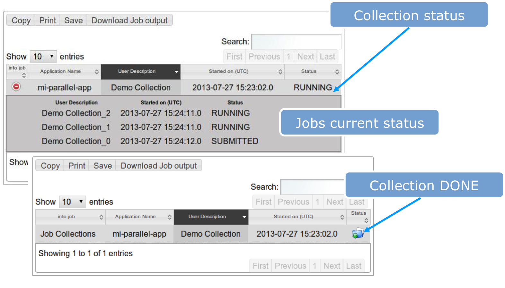

# MYJOBS

## About

Portlet for managing jobs. 

## Installation

Deploy MyJobs.war  with: cp MyJobs `$LIFERAY_HOME/deploy/`
Watch the Liferay’ server.log file till: ‘MyJobs successfully deployed’ 

### Requirements
Application registration in the GridOperations table is mandatory for the MyJobs portlet

 

*How to get GridOperations values*

* id – Just a numeric value; ‘9’ historically used by Tester Apps
* portal – Value added in the preference - liferay control panel
* description –  Use any human readable application description

GridOperations values will be carefully selected for production portals

## Usage

## Support
